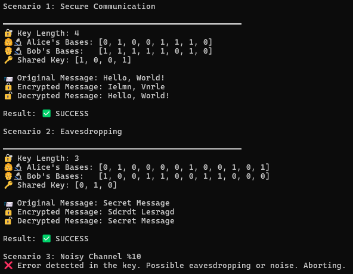
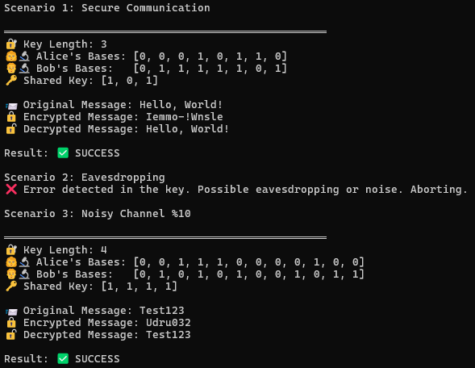
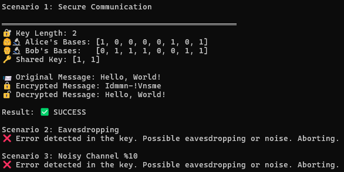
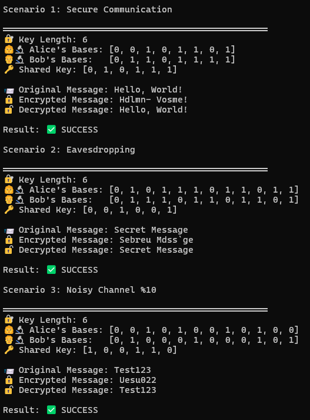

# QuantumBB84

## Overview
QuantumBB84 is a Python version of the **BB84 protocol**, one of the first quantum key distribution (QKD) processes. The BB84 protocol enables two parties—Alice and Bob—to exchange a **secure cryptographic key** using the principles of **quantum mechanics**, which makes it detectable if any eavesdropping is performed.

## Why Use Quantum Cryptography?
Traditional encryption methods rely on computational complexity, so they could be vulnerable to powerful quantum computers in the future. Quantum cryptography, on the other hand, takes advantage of **superposition** and **quantum measurement principles** to offer security that isn't mathematically founded—it's backed by the fundamental laws of physics.

## Features
- **Quantum key distribution (QKD)** using the BB84 protocol.
- **Eavesdropping detection**, illustrating how quantum mechanics ensures interception prevention.
- **Noisy channel simulation** to mimic real-world imperfections.
- **Key reconciliation** to generate a final secure key.
- **Basic encryption and decryption** with the shared key.
- **Qiskit Aer simulator** for optimized quantum circuit running.

## Installation
Install dependencies before execution of the simulation:

```bash
pip install qiskit qiskit-aer
```

## How to Use
You can run different scenarios to see how quantum key distribution is practiced in real life.

### Secure Communication
This illustrates Alice and Bob successfully sharing a key and encrypting a message:
```python
bb84_secure = QuantumBB84(key_length=8, eve_present=False, noise_level=0)
bb84_secure.run("Hello, World!")
```

### Eavesdropping Scenario
Here, an eavesdropper (Eve) tries to tap the channel, introducing detectable errors:
```python
bb84_eve = QuantumBB84(key_length=12, eve_present=True, noise_level=0)
bb84_eve.run("Secret Message")
```

### Noisy Channel Simulation
This test includes a **10% depolarizing noise** to simulate the imperfections present in real systems:
```python
bb84_noise = QuantumBB84(key_length=12, eve_present=False, noise_level=0.1)
bb84_noise.run("Test123")
```

## Expected Results
- **Secure Communication:** Alice and Bob successfully share a key and encrypt/decrypt messages.
- **Eavesdropping Detection:** Inconsistencies occur in the key upon interception by Eve.
- **Noisy Channel Effects:** There are some errors, but key sharing remains feasible under reasonable assumptions.

## Screenshots  
Here are some sample outputs from different scenarios:  

### Output 1  
  

### Output 2 
  

### Output 3  
  

### Output 4
 

## Future Improvements
- Utilize **error correction** to increase the reliability of the system in noisy channels.
- Offer support to actual **quantum hardware**, including IBM Quantum Experience.
- Include **privacy amplification** to enhance the security of the key.

## Final Thoughts
QuantumBB84 is an interactive demonstration of the way **quantum cryptography** can provide secure communication channels. Unlike traditional encryption, which relies on puzzles that are difficult to solve, this method derives security from the underlying principles of quantum mechanics. As technology advances, protocols like BB84 will be important to protect data against the new wave of cyber attacks.

---

## License
This project is open-source under the **MIT License**. Contributions and feedback are appreciated!


