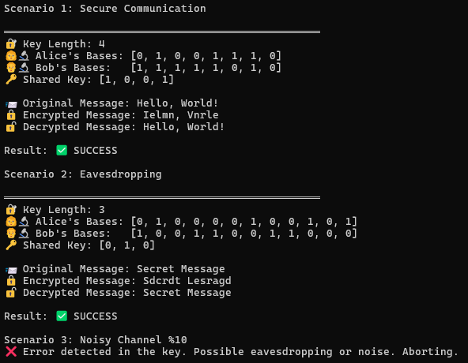
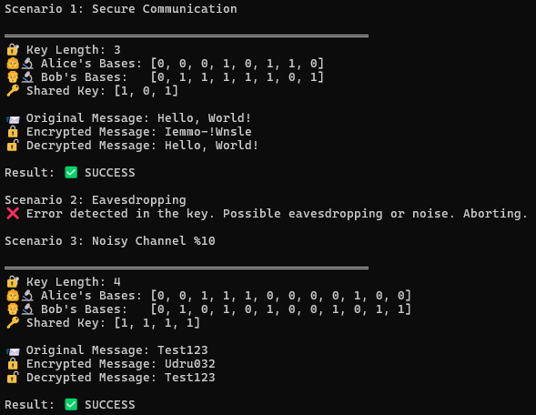
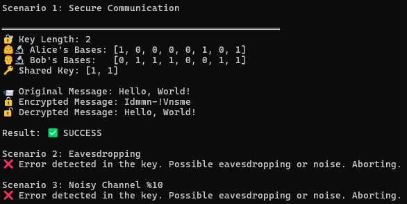
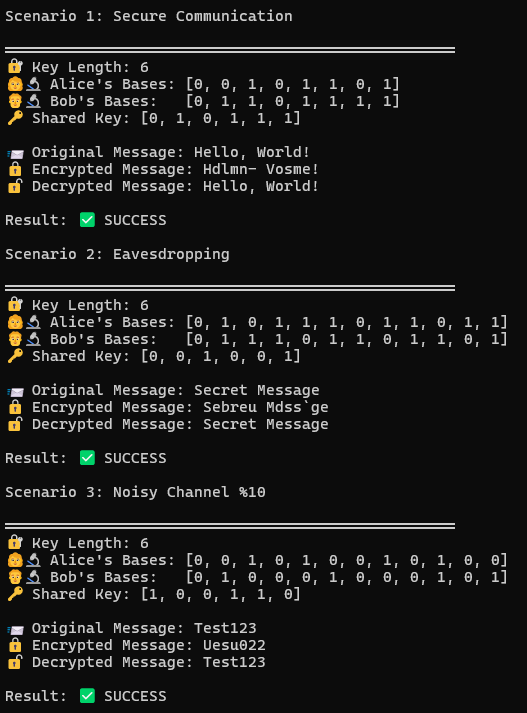

# QuantumBB84

## Overview
QuantumBB84 is an educational Python simulation of the **BB84 protocol**, one of the earliest quantum key distribution (QKD) protocols. It models how Alice and Bob establish shared key material and how interception can introduce observable mismatches.

> This project is intended for learning and simulation. It is not a production cryptographic implementation.

## Why Use Quantum Cryptography?
Some widely used public-key systems rely on computational problems that sufficiently capable quantum computers could solve more efficiently. QKD explores a different approach: using **superposition** and **measurement disturbance** to reveal interference with the communication channel.

## Features
- **Quantum key distribution (QKD)** using the BB84 protocol.
- **Eavesdropping simulation**, illustrating how interception can alter measurement results.
- **Noisy channel simulation** to mimic real-world imperfections.
- **Key reconciliation** to generate a final secure key.
- **Toy encryption and decryption demonstration** using the shared key output.
- **Qiskit Aer simulator** for optimized quantum circuit running.

## Installation
Install dependencies before execution of the simulation:

```bash
pip install -r requirements.txt
```

## How to Use
You can run different scenarios to see how quantum key distribution is practiced in real life.

### Secure Communication
This illustrates Alice and Bob successfully sharing a key and encrypting a message:
```python
bb84_secure = QuantumBB84(key_length=8, eve_present=False, noise_level=0)
bb84_secure.run("Hello, World!")
```

### Eavesdropping Scenario
Here, an eavesdropper (Eve) tries to tap the channel, introducing detectable errors:
```python
bb84_eve = QuantumBB84(key_length=12, eve_present=True, noise_level=0)
bb84_eve.run("Secret Message")
```

### Noisy Channel Simulation
This test includes a **10% depolarizing noise** to simulate the imperfections present in real systems:
```python
bb84_noise = QuantumBB84(key_length=12, eve_present=False, noise_level=0.1)
bb84_noise.run("Test123")
```

## Expected Results
- **Secure Communication:** Alice and Bob successfully share a key and encrypt/decrypt messages.
- **Eavesdropping Detection:** Inconsistencies occur in the key upon interception by Eve.
- **Noisy Channel Effects:** There are some errors, but key sharing remains feasible under reasonable assumptions.

## Screenshots  
Here are some sample outputs from different scenarios:  

### Output 1  
  

### Output 2 
  

### Output 3  
  

### Output 4
 


## Final Thoughts
QuantumBB84 is an interactive introduction to quantum key distribution concepts. It focuses on basis selection, measurement, channel noise and the observable effects of interception in a simulated environment.

---

## License
This project is open-source under the **MIT License**. Contributions and feedback are appreciated!


